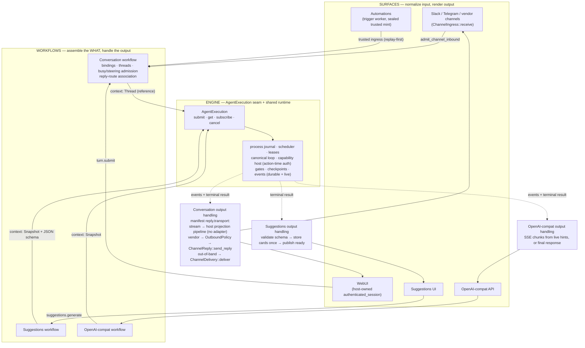

# Agent execution architecture: one engine, many surfaces

**Status:** Discussion draft
**Grounded in:** `main` @ `d4fa8e1f60`
**Companion:** [2026-08-12-agent-execution-seam.md](2026-08-12-agent-execution-seam.md)
— the seam itself: the `AgentExecution` port, the request contract,
`AgentMessage`, `OutputContract`, events, and the invariants (I1–I5) this
document builds on.

## 1. The rule this document exists to make obvious

Every product feature that runs the agent — vendor channels, the WebUI,
automations, suggestions, OpenAI-compat — is a **workflow** that does exactly
three things:

1. **Normalize its input** through its own ingress (webhook translation,
   session route, trigger fire, API request).
2. **Submit one `AgentExecutionRequest`** through the one `AgentExecution`
   seam.
3. **Interpret the execution's output in its own way** — and *only* its own
   way: conversations reply through the channel reply machinery (manifest-
   driven: stream or final send), suggestions validate and store cards,
   OpenAI-compat renders an HTTP response.

The engine never knows which surface called it, never sees routing data, and
never delivers anything. Nothing else in the system runs the agent.

## 2. The three layers

| Layer | Examples | Owns | Never does |
|---|---|---|---|
| **Surface** (ingress + rendering) | Slack/Telegram adapters, WebUI routes, trigger worker, suggestions UI, OpenAI-compat HTTP | Protocol translation, verification hand-off, rendering output for its vendor/client | Create threads, build prompts, call the engine, touch policy or delivery stores |
| **Workflow** (product logic) | Conversation workflow, suggestions workflow, OpenAI-compat workflow | Request assembly (the *what*), output handling, its own state (threads/bindings, suggestion store) and reply-route associations | Run the loop, authorize capabilities, invent events, bypass the seam to mutate run state |
| **Engine** (`AgentExecution` + shared runtime) | Seam port; process journal, scheduler, leases, canonical loop, capability host, gates, events | Admission, scheduling, execution, action-time authorization, gates, checkpoints, the execution journal and live hints, cancellation | Know about surfaces, hold reply targets or vendor IDs, deliver output, parse external identifiers |

Two admission doors already exist on `main` and stay exactly where they are:
verified vendor messages enter through
`ChannelInboundProductSurface::admit_channel_inbound`; authenticated sessions
and feature surfaces enter through `ProductSurface::invoke` operations
(`turn.submit`, `gate.resolve`, and — new — `suggestions.generate`).
Operations select trusted workflows; payloads never select prompts, tools, or
authority.

## 3. The whole system in one picture



Read it once top-down and once bottom-up. Top-down: five surfaces, three
workflows, one seam, one runtime. Bottom-up: one output stream, three
interpretations — reply machinery for anything conversation-shaped, a store
for suggestions, an HTTP response for OpenAI-compat.

## 4. The one request, and the one point of variance

Every workflow submits the same five-field request (full contract in the
companion document):

```rust
pub struct AgentExecutionRequest {
    pub context: ExecutionContext,      // Thread(reference) | Snapshot(system_prompt, messages)
    pub tools: Vec<CapabilityId>,       // selection, authorized per-call at action time
    pub model: Option<ModelProfileId>,  // preference; host resolves, validates, falls back
    pub output: OutputContract,         // AssistantMessage | JsonSchema { schema, strict }
    pub limits: ExecutionLimits,        // narrowing-only
}
```

`context` is the only structural difference between workflows, and the
distinction is *reference vs. copy*:

- **`Thread`** — a reference. The host materializes history from the thread
  at run time through the existing thread-backed context port, so steering,
  compaction, and rebuild-on-resume keep working by construction. This is how
  conversations share the seam without freezing what must stay alive.
- **`Snapshot`** — a caller-supplied, point-in-time input, frozen at
  submission (content landed as refs at admission).

Everything else that differs between workflows differs **by value**, and the
engine behaves accordingly through profiles:

| | `Thread` (conversations, automations) | `Snapshot` (suggestions, OpenAI-compat) |
|---|---|---|
| Submitted by | conversation workflow only | detached workflows |
| Admission | one active run per thread; busy input settles as steering (`DeferredBusy`) or `RejectedBusy` | concurrent; idempotency only |
| Context at run time | materialized from the thread, fresh each iteration | materialized from the stored snapshot refs |
| Steering mid-run | yes (profile-gated), drained by the running loop | no (profile-disabled) |
| Gates | allowed — approval/auth surfaces exist (WebUI `gate.resolve`, channel approval replies) | not supported — non-gating surface; a gate is a typed `GateNotSupported` failure |
| Run profile | conversation profiles (interactive, scheduled trigger, …) | `detached_default` / `detached_structured` (derived from `output`) |
| Thread transcript | written by the run's thread-backed machinery, lease-fenced (exactly as today) | none — the execution journal is the only record |
| Subagents | per profile | denied |
| Typical `output` | `AssistantMessage` | either; suggestions use `JsonSchema` |

## 5. The flows

Each flow below is: ingress → submit → output handling. The submit step is
deliberately near-identical everywhere; the output handling is deliberately
different everywhere.

### 5.1 Vendor channel conversation (Slack, Telegram, …)

Ingress uses the channel contracts that landed in #7477: the extension
implements protocol translation only; the host owns verification, staging,
admission, and everything after.

```python
def handle_vendor_webhook(raw_request):
    # HOST (extension ingress router): verify the vendor signature, stage the
    # payload durably, answer 2xx. Verification evidence is minted only by
    # the sealed verifier.
    verified = ingress_verifier.verify(raw_request)

    # EXTENSION (ChannelIngress::receive): pure protocol translation, plus
    # attachment/context fetch through manifest-restricted egress. Returns one
    # complete normalized inbound. No threads, no engine, no policy.
    inbound = channel_ingress.receive(verified, restricted_egress)

    # HOST: the one channel admission door.
    channel_inbound_surface.admit_channel_inbound(inbound)


def conversation_submit(inbound):
    # PRODUCT (conversation workflow) — identical for every channel.
    binding  = bindings.resolve_or_create_binding(inbound.external_conversation)
    accepted = threads.accept_user_message(binding.thread_id, inbound.message)

    if accepted.deferred_busy:
        # Thread already has an active run: the message was enqueued as
        # steering input and the RUNNING loop will drain it. No new run.
        return

    execution = agent_execution.submit(
        execution_caller_from(inbound.actor),        # run acts as its invoker
        SubmitAgentExecutionRequest(
            idempotency_key=accepted.idempotency_key,
            execution=AgentExecutionRequest(
                context=Thread(binding.thread_id, accepted_message=accepted.ref),
                tools=[],                            # must be empty for Thread:
                                                     # surface is profile-derived
                model=None,                          # user/tenant default (a model
                                                     # picker choice would ride here)
                output=AssistantMessage,
                limits=conversation_limits(),
            ),
        ),
    )

    # Reply routing NEVER enters the engine. The workflow keeps it.
    conversation_runs.associate(binding, execution.execution_id)
```

### 5.2 Conversation output handling — one generic flow, manifest-driven

This is the piece that makes channels generic: the workflow consults the
channel's **manifest**, never the vendor. The reply axis already carries this
on `main`: a channel declaring `[channel.reply] transport = "stream"`
implements nothing — the host publishes to the durable projection pipeline
and the adapter is never called; any other transport means the extension
implements `ChannelReply::send_reply`.

```python
def handle_conversation_output(binding, execution_id):
    # PRODUCT (conversation workflow). The thread transcript was already
    # written by the run itself (lease-fenced, engine-side) — output handling
    # is about REPLY, never persistence.
    reply = manifest(binding.channel).reply

    if reply.transport == "stream":
        # Host-owned: execution events/live hints project into the durable
        # product stream; the surface (WebUI tab) tails it over SSE with a
        # resumable cursor. ChannelReply is never called — that absence is
        # what `stream` means.
        return

    # Vendor-transport reply: wait for the terminal result, then send one
    # source-routed answer through the reply lane.
    result = await_terminal(agent_execution.subscribe(caller, execution_id))
    envelope = outbound_envelope(binding.reply_route, result.output.assistant_message)

    validated = outbound_policy.validate(envelope)     # revalidates the target,
                                                       # records the delivery attempt
    channel_reply.send_reply(validated, restricted_egress)   # extension renders + sends
```

Two deliberate consequences:

- **Streaming vs. whole-message is a manifest fact, not vendor code.** WebUI
  is simply a channel whose reply transport is `stream`. A future vendor that
  can stream (message edits) opts in through its manifest and a presentation
  policy over the same execution events — no new engine surface, no
  per-vendor workflow code.
- **Reply and delivery stay orthogonal lanes.** Answering the run's input is
  `ChannelReply` (source-routed). Reaching someone out of band —
  notifications, automation results pushed to a different conversation — is
  `ChannelDelivery::deliver` (target-resolved), always through outbound
  policy. One run may use both, either, or neither.

### 5.3 WebUI

```python
def send_message(session_caller, thread_id, body):
    # SURFACE: authenticated_session ingress is host-owned — no extension
    # adapter exists or is needed. The route invokes ProductSurface
    # ("turn.submit"), which normalizes into the same conversation workflow.
    inbound = session_ingress.normalize(session_caller, thread_id, body)
    inbound.attachments = artifact_store.land(inbound.attachment_bytes)
    conversation_submit(inbound)

# Output: the WebUI channel's reply transport is `stream` — §5.2's first
# branch. The browser tails the product event stream (snapshot + cursor
# replay + live tail). Gate resolution comes back in through
# ProductSurface("gate.resolve") and resumes the blocked run through the
# approvals machinery.
```

### 5.4 Automations (trigger fires)

Automations are conversation-shaped: a fire becomes a message in a bound
conversation and runs under the scheduled-trigger profile. The only special
thing about them is *trust at ingress* — and it is sealed, not conventional.

```python
def on_trigger_due(fire, materialized_prompt):
    # TRIGGER WORKER (host): the only place a trusted trigger request can be
    # minted — the constructor runs the prompt-injection scan at mint time,
    # so "the prompt passed" is an invariant of the type.
    trusted = TrustedTriggerSubmitRequest.new(fire, materialized_prompt)

    # CONVERSATION-OWNED trusted submitter: replay-first (a duplicate fire
    # replays the original turn), then the SAME conversation workflow —
    # scheduled_trigger profile, whose deny-map strips trigger-mutating
    # capabilities.
    conversation_trusted_submitter.submit_trusted_trigger_fire(trusted)
    #   → conversation_submit(...) → context: Thread → the same seam
```

Output handling is §5.2 unchanged: reply into the bound conversation through
`ChannelReply`, and/or out-of-band notification through `ChannelDelivery`
under outbound policy. Automations never grow their own delivery path.

### 5.5 Suggestions

Suggestions are the canonical detached workflow: no thread, no binding, no
reply machinery — the output's home is the suggestions store.

```python
def generate_suggestions(surface_caller, req):
    # SURFACE: ProductSurface operation "suggestions.generate". The payload
    # selects inputs; it cannot select prompts, tools, or authority.
    caller = execution_caller_from(surface_caller)

    execution = agent_execution.submit(caller, SubmitAgentExecutionRequest(
        idempotency_key=req.idempotency_key,
        execution=AgentExecutionRequest(
            context=Snapshot(
                system_prompt=SUGGESTIONS_PROMPT,        # prompts/*.md, include_str!
                messages=[user_message(req.goal)],
            ),
            tools=["builtin.memory_search"],             # or []
            model=None,
            output=JsonSchema("suggestion-cards:v1", strict=True),
            limits=ExecutionLimits(max_iterations=6, wall_clock=seconds(60)),
        ),
    ))
    suggestions.associate(req.id, execution.execution_id)


def on_suggestion_terminal(execution_id, result, req):
    # The engine already schema-validated the output before reporting
    # success; this re-checks the declared schema and stores idempotently.
    cards = require_structured(result.output, "suggestion-cards:v1")
    suggestions.persist_cards_once(req.id, execution_id, cards)
    suggestion_events.publish_ready(req.id)
```

What suggestions deliberately never touch: threads, conversation bindings,
`ChannelReply`, `ChannelDelivery`, outbound policy. Readiness reaches the UI
through the product event stream like any other product projection.

### 5.6 OpenAI-compat

The adopter that retires a live hack: today the caller's message list is
JSON-flattened into one user message in a manufactured thread and
`response_format` is dropped. On the seam it is a plain detached workflow.

```python
def chat_completion(api_caller, api_request):
    execution = agent_execution.submit(
        execution_caller_from(api_caller),
        SubmitAgentExecutionRequest(
            idempotency_key=derive_key(api_request),
            execution=AgentExecutionRequest(
                context=Snapshot(
                    system_prompt=from_system_messages(api_request.messages),
                    messages=non_system_messages(api_request.messages),  # no flattening
                ),
                tools=external_tool_ids(api_request.tools),  # ExternalToolCatalog path
                model=model_hint(api_request.model),
                output=output_contract_from(api_request.response_format),  # no longer dropped
                limits=from_openai_params(api_request),
            ),
        ),
    )

    if api_request.stream:
        # SSE chunks are derived from the execution's live text hints
        # (cumulative → delta at the HTTP edge); the terminal event closes
        # the stream.
        return sse_from(agent_execution.subscribe(caller, execution.execution_id))

    result = await_terminal(agent_execution.subscribe(caller, execution.execution_id))
    return openai_response_from(result)
```

Client-executed tools keep their existing shape: the model calls an
`external_tool.*` capability, the run parks on the external-tool gate, the
client posts the tool output, the run resumes. No thread, no reply machinery,
no vendor anything.

## 6. Boundary rules

1. **Surfaces never call `AgentExecution`.** They reach a workflow through
   one of the two admission doors (channel admission or a `ProductSurface`
   operation). Untrusted payloads select inputs, never prompts, tools,
   models, or authority.
2. **Workflows are the only submitters.** A workflow assembles the request
   (the *what*), constructs the authenticated `ExecutionCaller` (the *who* —
   scope + acting user, run-acts-as-invoker), and owns the association
   between its domain object and the `ExecutionId`.
3. **The engine never sees routing data.** No reply targets, binding refs,
   vendor IDs, HTTP details, or `ProductTurnContext` inside the request or
   the journal. Reply routing lives in the conversation workflow's
   association state.
4. **Output leaves the engine exactly one way**: the observation seam —
   durable events plus terminal result, with live hints on the ephemeral
   plane. Every workflow interprets that same output differently, and no
   workflow reads another's.
5. **Only conversation-shaped workflows touch reply/delivery machinery.**
   Channels and automations answer through `ChannelReply` (source-routed) or
   notify through `ChannelDelivery` (target-resolved), always behind outbound
   policy revalidation and delivery-attempt records. Detached workflows never
   do; their output's home is their own store or their client connection.
6. **The manifest, not vendor code, decides channel output mode.**
   `reply.transport = "stream"` means host projection pipeline and no adapter
   call; any vendor transport means `send_reply`. Adding a channel adds
   manifest axes and translation methods — never a new engine or workflow
   branch.
7. **Capability authority never rides in a request.** Tools are a selection;
   every call is authorized at action time by the capability host, under the
   execution's acting identity — identically for both context kinds.
8. **Thread transcripts are written by the run, not by output handlers.**
   The engine's thread-backed machinery persists conversation messages
   lease-fenced during the run (exactly as today); output handling is about
   reply, never persistence. Snapshot executions have no transcript beyond
   the execution journal.

## 7. Sequencing

**Phase 1 — the seam and the detached class** (the companion proposal).
`AgentExecution` port; `Snapshot` context; detached profiles;
`OutputContract` + schema registry + reply-admission enforcement; the
observation façade. Conversations untouched; suggestions and OpenAI-compat
can adopt as soon as this lands.

**Phase 2 — conversations behind the seam.** `ExecutionContext::Thread` maps
1:1 onto today's `SubmitTurnRequest` core (scope + actor → caller; thread +
accepted message → context; profile/model hints; idempotency key), so this
phase is a re-plumbing of the entry point, not a rebuild: the coordinator's
admission (one-active-run-per-thread, busy → steering), scheduler, loop host,
gates, and transcript writes are unchanged underneath. The two things that
move are by design: binding refs / `ProductTurnContext` leave the engine
request for the workflow's association state, and the delivery observer reads
reply routes from that state. Contract tests must prove admission semantics
(`DeferredBusy`, `RejectedBusy`, replay) are byte-identical before cutover.

**Phase 3 — output-handling upgrades.** The delivery observer consumes
terminal events from `subscribe` instead of polling `get_run_state` every
250 ms; vendor streaming-by-edits ships as a manifest presentation policy
over the same execution events for channels that want it.

## 8. Related documents

- [2026-08-12-agent-execution-seam.md](2026-08-12-agent-execution-seam.md) —
  the seam contract this document composes (request, `AgentMessage`,
  `OutputContract`, events, invariants I1–I5, crate placement).
- [2026-08-10-unified-channel-model.md](2026-08-10-unified-channel-model.md)
  — why WebUI is a channel and `authenticated_session` ingress is host-owned.
- [2026-08-11-channel-adapter-contract.md](2026-08-11-channel-adapter-contract.md)
  — the `ChannelIngress` / `ChannelReply` / `ChannelDelivery` split (#7477)
  the flows above consume.
- `docs/reborn/contracts/conversation-binding.md` — binding resolution,
  idempotent accepted messages, `DeferredBusy`/`RejectedBusy` steering
  admission, sealed trusted trigger ingress.
- `docs/reborn/contracts/events-projections.md` — the durable-vs-live event
  planes and stream item vocabulary the observation façade standardizes.
- `docs/reborn/contracts/approvals.md` — gate leases and resume, reached from
  conversation surfaces only.
