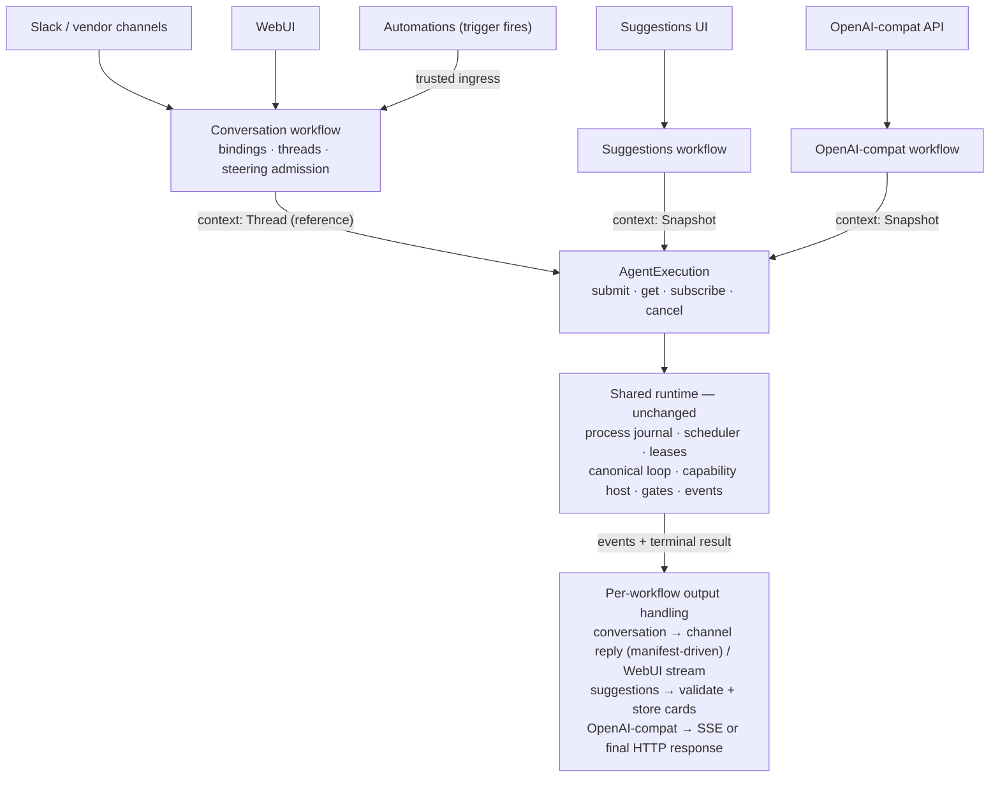

# Proposal: the `AgentExecution` seam

**Status:** Discussion draft
**Grounded in:** `main` @ `d4fa8e1f60`
**Companion:** [2026-08-12-agent-execution-architecture.md](2026-08-12-agent-execution-architecture.md)
— the system-level picture: how every surface (channels, WebUI, automations,
suggestions, OpenAI-compat) reaches this one seam and handles its output.

## Summary

IronClaw's durable agent runtime — admission, scheduling, leases, the
model/tool loop, gates, checkpoints, events, cancellation — can currently be
entered only through a conversation turn. This proposes `AgentExecution`: the
one product-neutral port for submitting and observing agent executions. An
execution's context is either a **thread reference** (conversations — the
host materializes history at run time, exactly as today) or a caller-supplied
**snapshot** (**detached executions**: durable, possibly tool-using,
schema-validated invocations with no conversational state — suggestions,
OpenAI-compat, background analyses). Detached executions are a new *run
class* on the existing runtime, not a new runtime: the same process journal,
scheduler, canonical loop, capability authorization, and event machinery
execute both kinds.

The contract line that makes this safe: **the caller owns the what** (acting
identity, scope, context, tool selection, output contract, limits, model
preference); **the host owns the how** (action-time authorization, run
profiles, context materialization, compaction and recovery, model validation
and fallback, loop strategy). Conversation behavior does not change —
thread-backed materialization, steering, and gates work exactly as today,
because the conversation context crosses the seam as a *reference, not a
copy*. The companion document specifies every surface's path end to end.

## 1. Problem

Every entry into the runtime today is shaped like a conversation turn.
`SubmitTurnRequest` requires a `TurnScope` (which embeds a `ThreadId`), an
`AcceptedMessageRef`, and source/reply binding refs. That is right for Slack
and the WebUI: their input belongs to a conversation, so the system resolves a
thread, stores the message, and runs the agent against the thread's history.

A feature that is *not* a conversation must either manufacture a hidden thread
or build a parallel stack. This is not hypothetical — it is already shipping:

- **OpenAI-compat is the live workaround.** It accepts a caller-assembled
  request (messages + tools + `response_format`) and, because no neutral entry
  exists, it JSON-flattens the entire message list into *one* user message
  injected into a manufactured thread
  (`ironclaw_openai_compat/src/chat_workflow.rs`), and silently drops
  `response_format`. Caller-supplied *tools* fare better — they become real
  per-run capabilities via `ExternalToolCatalog`.
- **Structured output does not exist.** There is no `ResponseFormat` or
  JSON-schema response mode anywhere in `ironclaw_llm` or the loop contracts,
  so any feature needing schema-validated results has nothing to build on.
- **Settlement observation is a polling loop.** Channel delivery watches
  `TurnCoordinator::get_run_state` every 250 ms
  (`ironclaw_assistant/src/run_delivery/observer.rs`) because there is no
  execution-scoped subscribe.

Two scoping notes, so the seam is sized honestly:

- **The motivating class, not a single feature.** Suggestions is the canonical
  example (generate schema-validated cards from a goal, maybe with a memory
  lookup), but it does not exist yet; the class also includes OpenAI-compat
  requests, background analyses, and future one-shot product features. The
  first committed adopter may well be OpenAI-compat.
- **One-off inference already has a home.** `SystemInferencePort` serves
  host-internal single completions (compaction summaries, failure
  explanations). A feature that is one tool-less completion can use that. This
  seam is for work that needs the *loop*: tools, durability, streaming,
  recovery.

The principle:

> Threads should remain the state model for conversations, not the required
> input model for every agent invocation.

## 2. The runtime today, and the invariants this design must respect

The design below is shaped by how the runtime actually works. Five facts
matter; each is an invariant this proposal preserves rather than renegotiates.

**I1 — The loop never holds materialized context.** The submit request is a
refs-and-hints envelope. The loop pulls context from the host once per
iteration as content refs (`LoopModelMessage { role, content_ref }`); prompt
text materializes host-side at model-call time, and `LoopPromptBundleAuthority`
rejects any model request whose messages do not byte-match the host-built
bundle. Checkpoints are ≤64 KiB of refs and strategy state — zero content — so
resume *rebuilds* context. Skills, identity, and memory snippets are injected
by the host during materialization, under profile policy.

**I2 — Context is alive during a run.** Steering can inject new user input
into a running loop; compaction durably rewrites history mid-run (summaries
replace sequence ranges); the visible tool surface is versioned and can change
between iterations (e.g. after an auth completes).

**I3 — Authorization happens at action time.** The visible tool surface is a
UX and reasoning aid, never an authorization shortcut. Every capability call
crosses `CapabilityHost` authorization when it happens; approval leases are
exact-invocation fingerprinted one-shots; host-side deny maps (e.g. the
scheduled-trigger deny list) exist precisely so callers cannot name their own
surface. Authority is never serialized state.

**I4 — Policy attaches through run profiles, resolved once at submit.** A
`ResolvedRunProfile` carries the loop driver (and thus loop family), the
capability-surface profile, checkpoint schema, steering/cancellation/budget
policies, and scheduling/concurrency classes. It is persisted at admission and
drift-checked at claim. Model choice is three-staged: tenant policy → fail-
closed route validation at host construction → a per-iteration fallback walk.

**I5 — The durable substrate is already product-neutral, and events have two
retention classes.** `ironclaw_processes` owns the journal, 90-second leases,
wake+poll claims, bounded crash reclaims, and zombie guards; the turn pipeline
is "an agent-turn projection over the generic process supervisor"
(`turn_scheduler.rs`). Durable events are coarse, redacted lifecycle facts;
streaming text is deliberately an *ephemeral live hint* (coalesced, process-
local, epoch-guarded), with exactly one durable text record: the finalized
message. Turn state stores "lifecycle metadata and references only" — raw
content never enters it.

## 3. Design principle: the caller owns the *what*, the host owns the *how*

| The caller (workflow) owns | The host (runtime) owns |
|---|---|
| Acting identity and tenant scope | Action-time capability authorization, approvals, dispatch |
| The context snapshot (what the model may see) | Context materialization, window management, compaction |
| Tool **selection** (which affordances to expose) | The visible surface, deny maps, per-call authorization |
| Output contract (assistant message vs. strict schema) | Contract enforcement, retry/repair, terminal validation |
| Model **preference** (profile hint) | Model resolution, fail-closed route validation, mid-run fallback |
| Limits (narrowing only) | Budget enforcement, scheduling, leases, crash recovery |
| Idempotency key | Deduplication, replay, exactly-once terminal settlement |

Everything in the left column serializes into the durable request. Nothing in
the right column does — it is resolved by the host at admission or at action
time, exactly as for conversation turns today.



Each workflow interprets the same execution output differently — the flows,
including the manifest-driven stream-vs-reply decision for channels, are
specified in the companion architecture document.

## 4. Proposed design

### 4.1 The seam

One product-facing port for submitting and observing executions:

```rust
#[async_trait]
pub trait AgentExecution: Send + Sync {
    /// Durably admit and queue an execution.
    /// Returning does not mean model execution has started.
    async fn submit(
        &self,
        caller: ExecutionCaller,
        request: SubmitAgentExecutionRequest,
    ) -> Result<ExecutionSubmitted, SubmitExecutionError>;

    /// Read the latest durable state without advancing execution.
    async fn get(
        &self,
        caller: ExecutionCaller,
        execution_id: ExecutionId,
    ) -> Result<ExecutionSnapshot, ObserveExecutionError>;

    /// Replay durable events after `after`, then continue with live items.
    async fn subscribe(
        &self,
        caller: ExecutionCaller,
        execution_id: ExecutionId,
        after: Option<ExecutionCursor>,
    ) -> Result<Box<dyn ExecutionSubscription>, ObserveExecutionError>;

    /// Record cancellation intent and interrupt queued or running work.
    async fn cancel(
        &self,
        caller: ExecutionCaller,
        execution_id: ExecutionId,
    ) -> Result<CancelExecutionResponse, CancelExecutionError>;
}
```

- `ExecutionCaller` is the authenticated per-call principal, mirroring
  `ProductSurfaceCaller`: the trusted, composition-wired workflow identity
  plus the tenant scope and acting user for this submission
  (run-acts-as-invoker). The workflow constructs it at a trusted edge from
  its own authenticated caller; the request payload carries no identity.
  `get`/`subscribe`/`cancel` verify the caller against the execution's
  stored scope, the same way turn control operations check
  `state.actor == request.actor` today. Untrusted requests never reach this
  port directly; they enter through `ProductSurface` operations that select
  a trusted workflow.
- `ExecutionId` is the product-facing identity; internally it maps 1:1 onto
  the run/process identity minted at admission. No parallel identity family.
- This is a dependency-inversion port: products consume it, the loop tier
  implements it, composition wires it — the same pattern as
  `CapabilityDispatcher`.

### 4.2 The request

```rust
pub struct SubmitAgentExecutionRequest {
    /// Dedup at durable admission. Same key + same payload replays the
    /// original ExecutionSubmitted; same key + different payload fails closed.
    pub idempotency_key: IdempotencyKey,
    pub execution: AgentExecutionRequest,
}

pub struct AgentExecutionRequest {
    /// WHAT the model may see — the only structural variance between
    /// workflows (see below).
    pub context: ExecutionContext,

    /// A selection, never authority (I3): intersected with profile policy
    /// and authorized per-call at action time. Empty = no tools.
    pub tools: Vec<CapabilityId>,

    /// Preference, not resolution (I4): the host validates the route
    /// fail-closed and retains mid-run fallback. None = profile default.
    pub model: Option<ModelProfileId>,

    /// The shape the terminal output must take.
    pub output: OutputContract,

    /// Narrowing-only limits, validated against profile ceilings.
    pub limits: ExecutionLimits,        // max_iterations?, wall_clock?, usd?, max_output_tokens?
}

pub enum ExecutionContext {
    /// Conversation surfaces (channels, WebUI, automations): a REFERENCE.
    /// The host materializes history from the thread at run time through the
    /// existing thread-backed context port, so steering, compaction, and
    /// rebuild-on-resume keep working by construction (I1, I2).
    Thread {
        /// Which conversation. Kept alongside the message ref so admission
        /// can key one-active-run-per-thread without a dereference, and
        /// cross-check the two fail-closed.
        thread_id: ThreadId,
        /// The accepted user message this run answers — today's
        /// `SubmitTurnRequest.accepted_message_ref`. History materializes
        /// through this message; later arrivals steer into the running loop
        /// or become the next turn, never silently widening this run's
        /// input. Pinning it keeps replays and retries deterministic.
        accepted_message: AcceptedMessageRef,
    },

    /// Detached surfaces (suggestions, OpenAI-compat, background work): a
    /// caller-supplied point-in-time snapshot, frozen at submission.
    Snapshot {
        /// The caller's task prompt. The resolved profile may prepend host
        /// protocol assets (tool disclosure, safety framing); callers own
        /// the task prompt, they do not replace the host frame.
        system_prompt: String,
        /// Complete snapshot, including the newest input. Text may be
        /// inline; images and files are ArtifactRefs inside messages (§4.4).
        messages: Vec<AgentMessage>,
    },
}
```

**Context is the one enum in the request — and it is earned.** Both variants
are real: `Snapshot` ships with this proposal; `Thread` is how conversation
submission moves behind the same seam (phased in the companion document —
`Thread` maps 1:1 onto today's `SubmitTurnRequest` core). The load-bearing
distinction is *reference vs. copy*: a caller-materialized copy of thread
history would freeze what must stay alive (steering, compaction,
rebuild-on-resume — I1, I2), so conversations cross the seam as a reference
and the host keeps materializing. A third variant needs its own proposal.
Everything else in the request varies by value, not by shape. (Continuation-
style snapshot callers need no third variant: because content lands as refs
at admission, a workflow composes a follow-on snapshot by reusing the prior
execution's refs and appending new input.)

**Identity rides on the caller, not in the payload.** `submit(caller,
request)` already carries an authenticated `ExecutionCaller` (§4.1) with the
tenant scope and acting user; duplicating them inside the request would only
create a second copy to keep consistent. The request is pure *what*; the
caller is pure *who*.

**Refs are a journal rule, not an API shape.** Callers pass ordinary messages
— inline text, attachments as `ArtifactRef` parts. At durable admission the
host lands inline content in the artifact/content store once and journals
refs, so the journal never stores a second copy of transcript-scale content
(I5), and the API stays as simple as the call it describes.

**Profiles are derived, not requested.** Every execution resolves a
`ResolvedRunProfile` at submit (I4), but the seam derives it rather than
adding a profile field to the request: `Snapshot` context resolves the new
detached profiles (`detached_structured` when `output` is a JSON schema,
`detached_default` otherwise); `Thread` context resolves conversation
profiles through the existing resolver exactly as turns do today
(interactive, scheduled trigger, …). A hint field can be added if variants
multiply.

What the host still owns at execution time, identically for both context
kinds:

- **Action-time authorization for every call** (I3). The selection shapes the
  *visible* surface; `CapabilityHost` authorizes each invocation when it
  happens. Nothing in the journal is an authorization.
- **Model resolution** (I4). The `model` preference feeds the existing
  three-stage chain; the result reports the *effective* model.
- **Run profile policy** (I4). Two new built-in profiles ship with this
  proposal, derived from the request as described above:
  - `detached_default` — snapshot context source; no memory lane; no skill
    injection; steering disabled; subagent spawn denied; non-gating surface.
  - `detached_structured` — `detached_default` plus structured-output reply
    admission (§4.5).
- **Materialization** (I1). A new snapshot-backed context source implements
  the existing `LoopContextPort` against the stored refs, so the canonical
  loop, compaction, checkpoints, recovery, and `LoopPromptBundleAuthority`
  work unchanged. A long tool-using execution compacts exactly like a
  conversation; the *durable request* stays as-submitted while the loop's
  working context evolves.

### 4.3 Output

```rust
pub struct AgentExecutionResult {
    pub output: AgentOutput,                 // interpreted against OutputContract
    pub usage: UsageSummary,
    pub effective_model: ModelProfileId,     // what actually ran (fallback-aware)
    pub finish_reason: AgentFinishReason,
}

pub enum AgentOutput {
    AssistantMessage(AgentMessage),
    Structured { schema: OutputSchemaRef, value: serde_json::Value },
}
```

- **One authoritative terminal output.** Intermediate assistant/tool messages
  belong to the execution's journal and progress stream, not the product
  result. `AgentOutput::AssistantMessage` must be an assistant-role message
  with no unresolved tool call.

### 4.4 The `AgentMessage` interface

`AgentMessage` is the message vocabulary of the seam, used in exactly two
places: `Snapshot` context input (§4.2) and the terminal
`AgentOutput::AssistantMessage` (§4.3). One vocabulary, both directions.
`Thread` context never carries messages across the seam at all — thread
history stays host-side (I1).

```rust
pub struct AgentMessage {
    pub role: AgentMessageRole,
    pub content: Vec<ContentPart>,
}

pub enum AgentMessageRole { User, Assistant, Tool }

pub enum ContentPart {
    /// Inline text at the API; journaled as a content ref at admission (§4.2).
    Text(String),
    /// Durable references; bytes stay in the artifact store. Never inline
    /// bytes, never provider URLs.
    Image(ArtifactRef),
    File(ArtifactRef),
    /// Assistant-only: a capability request the model made.
    ToolCall(ToolCallContent),
    /// Tool-only: the outcome paired to a prior ToolCall.
    ToolResult(ToolResultContent),
    /// Assistant-only: opaque provider reasoning artifacts that must
    /// round-trip on replay — some providers reject histories that drop them.
    Reasoning(ReasoningContent),
}

pub struct ToolCallContent {
    pub call_id: ToolCallId,
    /// Normalized capability identity, never a raw provider tool name.
    pub capability: CapabilityId,
    pub arguments: BoundedJson,
}

pub struct ToolResultContent {
    /// Must pair with a ToolCall earlier in the message list.
    pub call_id: ToolCallId,
    pub outcome: ToolResultOutcome,   // Text | Json | Artifacts(Vec<ArtifactRef>)
    pub is_error: bool,
}

pub struct ArtifactRef {
    pub artifact_id: ArtifactId,
    /// Metadata is advisory at submission; the artifact store is
    /// authoritative, and every use re-authorizes access under the
    /// execution's acting identity.
    pub mime_type: String,
    pub filename: Option<String>,
    pub size_bytes: u64,
}
```

**Ownership: extended, not duplicated.** This is not a third message family.
`ironclaw_llm` owns the provider-neutral vocabulary today as
`ChatMessage`/`ContentPart` — with three shapes worth naming because
`AgentMessage` is their cleanup: `content: String` *plus* a `content_parts`
overlay (two places for the same content), tool calls and results as flat
side fields (`tool_calls`, `tool_call_id`, `name`) rather than parts, and
`reasoning`/`reasoning_details` as side fields. `AgentMessage` is the
canonical shape of that same vocabulary — a pure parts list — defined in
`ironclaw_llm` with one owned, total conversion to and from the
provider-facing shapes. Provider adapters keep their wire types; nothing else
in the workspace defines a message type (the mirror-DTO ban applies).

**No `System` role, by construction.** The system prompt is a separate,
host-composed field on `Snapshot` context (§4.2); a role that could smuggle
system-prompt content through the message list deliberately does not exist.

**Role × part validity** — enforced fail-closed at submission
(`SubmitExecutionError`, before anything reaches the journal):

| Part | User | Assistant | Tool |
|---|---|---|---|
| `Text` | ✓ | ✓ | ✓ |
| `Image` / `File` | ✓ | ✓ (generated artifacts) | ✗ (artifacts ride `ToolResult.outcome`) |
| `ToolCall` | ✗ | ✓ | ✗ |
| `ToolResult` | ✗ | ✗ | ✓ (exactly one per message) |
| `Reasoning` | ✗ | ✓ | ✗ |

A flat struct with validation was chosen over per-role typed variants for
symmetry with provider APIs and the existing `ChatMessage`, and so
conversions stay total; the tradeoff — invalid combinations are
runtime-rejected rather than unrepresentable — is contained by validating at
the seam, so nothing invalid ever reaches a journal or a provider.

**Pairing and ordering rules.**

- Every `ToolResult.call_id` pairs with a `ToolCall` earlier in the list;
  unpaired calls or results are rejected at submission (providers reject
  broken pairs anyway — the seam fails closed before the journal does).
- `Reasoning` parts ride the assistant message that produced them and
  round-trip opaquely: never interpreted, never rendered to users. Precedent:
  `reasoning_details` exists on `ChatMessage` today because some providers
  return HTTP 400 when prior reasoning artifacts are dropped from replay.
- Terminal output (§4.3) adds: assistant role; no `ToolCall` parts (no
  unresolved work); at least one `Text` or artifact part.

**Bounds.** Per-part, per-message, and per-request byte budgets are enforced
at submission, and `BoundedJson` bounds tool arguments (values set with the
implementation; the workspace's bounded-ref discipline is the precedent).

**Snapshot input vs. thread history.** Snapshot callers author these messages
directly. Thread-context history never becomes caller-visible
`AgentMessage`s: it is materialized host-side, where replayed tool results
remain subject to the transcript safety contract (safe summaries plus
validated model-visible observations).

### 4.5 `OutputContract` — new shared surface

```rust
pub enum OutputContract {
    AssistantMessage,
    JsonSchema {
        schema: OutputSchemaRef,   // versioned, e.g. "suggestion-cards:v1"
        strict: bool,
    },
}
```

- **Registry ownership:** schemas are registered by the owning workflow crate
  into a host-owned registry keyed by name+version (declared, not inline JSON
  per request), so stored results stay interpretable after the fact.
- **Semantics:** `strict: true` — the terminal output must parse and validate
  against the schema or the attempt is rejected; `strict: false` — validate,
  and on failure surface the raw output with a typed `SchemaViolation`
  failure instead of retrying to exhaustion. (If review cannot name a use for
  `strict: false`, ship strict-only.)
- **Enforcement point:** a reply-admission strategy in the loop family. The
  loop already has a reply-admission slot that rejects invalid finals and
  drives a retry with a model-visible repair hint; a schema-validating
  admission strategy gets bounded retry/repair for free, and exhausted
  retries fail the run as `invalid_model_output`. This also gives
  `ironclaw_llm` a natural place to grow provider-native structured-output
  support later without changing the contract.

### 4.6 Gates: explicit policy

Detached profiles expose **non-gating surfaces**: capabilities whose policy
can require approval/auth are absent from the visible surface (the same
hide-vs-expose shaping surfaces already implement). If a gate fires anyway —
policy drift, auth expiry mid-run — the execution fails with a typed
`GateNotSupported { gate_kind }` outcome. No hung executions, and no approval
UI with no home to render in.

The durable event vocabulary still includes `Blocked`/`Resumed` so the journal
stays honest, and so a later revision can add a resolve affordance (wired to
the existing `ApprovalInteractionService` machinery) for workflows that
genuinely need gating tools. That affordance is out of scope here and needs
its own design (who renders the gate, actor validation, lease semantics).

### 4.7 Events and observation: two planes, one subscription

The runtime separates **durable lifecycle facts** from **ephemeral live
hints** (I5): text deltas are coalesced, process-local UI hints; the durable
log is coarse, redacted metadata; the only durable text is the finalized
output. This design keeps that split and re-keys both planes by execution:

```rust
/// Durable, replayable, redacted — the execution's journal.
pub enum ExecutionEvent {
    Accepted,
    Running,
    ToolCallStarted   { activity: CapabilityActivityView },
    ToolCallCompleted { activity: CapabilityActivityView },
    Blocked  { gate: ExecutionGateView },
    Resumed  { gate_ref: GateRef },
    Completed { result: AgentExecutionResultRef },
    Failed    { failure: AgentExecutionFailure },
    Cancelled,
}

/// Ephemeral, process-local, epoch-guarded — live hints, never replayed
/// losslessly across restarts.
pub enum ExecutionLiveHint {
    Text     { cumulative: SanitizedText },   // coalesced, replaceable body
    Thinking { cumulative: SanitizedText },
    ToolProgress { activity_id: CapabilityActivityId, progress: SafeToolProgress },
}

pub enum ExecutionStreamItem {
    Snapshot(ExecutionSnapshot),
    Event(ExecutionEvent),          // durable plane, cursor-advancing
    Live(ExecutionLiveHint),        // ephemeral plane
    RebaseRequired,                 // replay gap or foreign/stale cursor
    Lagged { reason: LagReason },   // buffer overrun or redaction block
    KeepAlive,
}
```

- `ExecutionCursor` composes a durable component and an epoch-guarded live
  component. Reconnecting mid-run replays durable events from the cursor and
  receives the *current* cumulative text, not a delta history — the same
  guarantee the WebUI stream has today.
- Durable kinds map onto the existing event vocabularies
  (`CapabilityActivity*`, turn-lifecycle blocked/resumed, loop terminal
  milestones) rather than minting a new event language; safe views reuse the
  existing `CapabilityActivityView` redaction machinery; everything crossing
  the seam passes the existing fail-closed redaction validation.
- Product workflows project these into their own stores and streams;
  transports continue to consume product projections, never raw model
  deltas.

```rust
pub struct ExecutionSnapshot {
    pub execution_id: ExecutionId,
    pub state: ExecutionState,     // Queued | Running | Blocked | Completed | Failed | Cancelled
    pub outcome: Option<ExecutionOutcome>,
    pub latest_cursor: Option<ExecutionCursor>,
}

pub struct ExecutionSubmitted {
    pub execution_id: ExecutionId,
    pub replayed: bool,            // true when idempotency replay, not new admission
}
```

### 4.8 Implementation sketch

```python
def submit(caller, request):
    # PUBLIC: authorize the seam, land inline content as refs, admit, queue.
    authorize_seam(caller)                                       # caller carries scope + acting user

    landed = land_inline_content_as_refs(request.execution)      # Snapshot text → refs (I5)
    profile = resolve_profile(request.execution)                 # Thread → conversation profiles, as today;
                                                                 # Snapshot → detached_{structured|default} (I4)
    validate_limits_narrow_only(request.execution.limits, profile)

    # Same process journal, leases, wake+poll scheduler as conversation turns.
    admission = process_runtime.admit_or_replay(
        kind=kind_for(request.execution.context),                # Thread = today's turn admission
                                                                 # (incl. one-active-run-per-thread + busy→steering)
        scope=caller.scope,
        acting_user=caller.acting_user,
        payload_refs=landed,
        resolved_run_profile=profile,
        operation_id=request.idempotency_key,
    )
    if admission.is_new:
        scheduler.wake(admission.scope)
    return ExecutionSubmitted(admission.execution_id, replayed=not admission.is_new)


def execute_claimed(claimed):
    # PRIVATE WORKER: identical machinery for both context kinds. Thread
    # context builds the thread-backed host — exactly today's path; Snapshot
    # context builds the one new component in this proposal.
    host = host_factory.create_host(claimed, context_source=context_port_for(claimed))
    #   Thread   → ThreadBackedLoopContextPort (existing)
    #   Snapshot → SnapshotBackedLoopContextPort (new, over the stored refs)
    driver = driver_registry.get(claimed.resolved_run_profile.loop_driver)
    exit = driver.run_or_resume(host, load_checkpoint_if_any(claimed))
    loop_exit_applier.apply(claimed, exit)   # evidence-validated terminal settle
```

There is no bespoke scheduler, lease logic, retry logic, or crash recovery in
this proposal: admission/replay, claims, heartbeats, bounded reclaims, and
evidence-validated terminal settlement are the existing process/turn
machinery (I5).

## 5. Relationship to the existing runtime

Nothing is replaced.

| Responsibility | Owner (unchanged) | This proposal adds |
|---|---|---|
| Durable admission, dedup, queueing | process journal + coordinator machinery | a detached admission path (no thread, no binding refs) |
| Scheduling, leases, crash recovery | `ProcessSupervisor` / scheduler | a run class with its own scheduling/concurrency class |
| Model/tool loop, checkpoints, recovery | canonical loop + loop families | `detached_*` profiles; a snapshot-backed `LoopContextPort`; a schema-validating reply-admission strategy |
| Capability authorization, approvals | `CapabilityHost` + approvals | nothing — action-time auth applies as-is |
| Durable events, projections, streams | events crates + product projections | an execution-scoped observation façade over both planes |
| Threads, conversation binding, steering | threads/conversations/turn services | nothing — conversation machinery and semantics are unchanged; only its *entry point* moves behind this port (companion doc, phased) |

**What is genuinely new** (complete list): the `AgentExecution` port and its
DTOs (the request with its two-variant `ExecutionContext`);
`SnapshotBackedLoopContextPort`;
the `detached_default`/`detached_structured` run profiles; `OutputContract` +
the schema registry + the reply-admission strategy; the execution observation
façade (cursor + subscription); the typed `GateNotSupported` failure.

**Follow-ups this unlocks** (each its own change, not part of this proposal):

1. **OpenAI-compat adopts the seam** (§5.3): `response_format` maps to
   `OutputContract`; the message list becomes a snapshot context instead of a
   flattened string; external tools keep their `ExternalToolCatalog` path.
2. **Delivery stops polling**: `RunDeliveryObserver` can consume the
   observation façade's terminal events instead of polling `get_run_state`.
3. **Conversation submission moves behind the seam**:
   `ExecutionContext::Thread` maps 1:1 onto today's `SubmitTurnRequest` core
   (scope + actor → caller; thread + accepted message → context; profile and
   model hints; idempotency key). Sequencing, and what stays workflow-side
   (binding refs, reply routing), is specified in the companion architecture
   document.

### 5.1 Conversation workflow — same machinery, same semantics

Slack, WebUI, and triggers keep today's machinery end to end: binding
resolution, accepted messages, thread-backed materialization, steering,
gates, delivery. Behind the seam, their submission is `context: Thread` — a
reference, not a copy — so nothing about conversation behavior changes; only
the entry point does, and in a later phase (companion document). Reply
routing and binding refs never enter the engine: they stay in the
conversation workflow's association state.

### 5.2 Suggestions workflow (the motivating class)

```python
def generate_suggestions(surface_caller, suggestion_request):
    # WHO: workflow principal + tenant scope + acting user, built from the
    # authenticated surface caller — never from the payload.
    caller = execution_caller_from(surface_caller)

    execution = agent_execution.submit(caller, SubmitAgentExecutionRequest(
        idempotency_key=suggestion_request.idempotency_key,
        execution=AgentExecutionRequest(
            context=Snapshot(
                system_prompt=SUGGESTIONS_PROMPT,            # prompts/*.md, include_str!
                messages=[user_message(suggestion_request.goal)],
            ),
            tools=["builtin.memory_search"],                 # or []
            model=None,                                      # profile default
            output=OutputContract.JsonSchema("suggestion-cards:v1", strict=True),
            limits=ExecutionLimits(max_iterations=6, wall_clock=Duration.seconds(60)),
        ),
    ))
    suggestions.associate(suggestion_request.id, execution.execution_id)
    return execution.execution_id


def project_suggestion_result(execution_id, result, suggestion_request):
    cards = require_structured(result.output, "suggestion-cards:v1")
    suggestions.persist_cards_once(suggestion_request.id, execution_id, cards)  # idempotent
    suggestion_events.publish_ready(suggestion_request.id)
```

The projector consumes the observation façade (terminal event → project),
with persistence keyed by `execution_id` so at-least-once delivery of the
terminal event cannot double-write. Untrusted callers reach this through a
`ProductSurface` operation (`suggestions.generate`); payloads select inputs,
never prompts, tools, or authority.

### 5.3 OpenAI-compat workflow (likely first adopter)

```python
def chat_completion(caller, openai_request):
    execution = agent_execution.submit(execution_caller_from(caller), SubmitAgentExecutionRequest(
        idempotency_key=derive_key(openai_request),
        execution=AgentExecutionRequest(
            context=Snapshot(
                system_prompt=from_system_messages(openai_request.messages),
                messages=non_system_messages(openai_request.messages),  # no flattening
            ),
            tools=external_tool_ids(openai_request.tools),           # ExternalToolCatalog path
            model=model_hint(openai_request.model),
            output=output_contract_from(openai_request.response_format),  # no longer dropped
            limits=from_openai_params(openai_request),
        ),
    ))
    return stream_or_poll(execution, openai_request.stream)
```

This retires the flatten-into-one-message hack and gives `response_format` a
real implementation — a concrete payoff of the seam that is independent of
any new feature shipping.

## 6. Non-goals

- No changes to the channel contracts. `ChannelIngress` / `ChannelReply` /
  `ChannelDelivery` landed in #7477 and are consumed as-is; the companion
  document shows exactly where they sit in each flow.
- No WebUI ingress changes beyond what the unified channel model already
  specifies, and no thread/conversation service renames.
- No conversation behavior changes. Moving conversation submission behind the
  seam (`context: Thread`) is a re-plumbing of the entry point — steering,
  compaction, gates, thread semantics are untouched, and it happens in its
  own phase (companion document), not in this proposal's first change.
- No durable text deltas; no new retention semantics ("LLM data is never
  deleted" applies to the execution journal as to everything else — which is
  exactly why it stores refs, not copies).
- No gate-resolution surface for detached executions (typed failure instead).
- No subagent spawn from detached executions (denied by profile).

## 7. Crate placement (proposal — needs architecture review)

| Piece | Home | Rationale |
|---|---|---|
| `AgentExecution` port + request/result/event DTOs | `ironclaw_loop_contracts` (contracts layer) | products may consume; loop tier implements; no new crate unless review prefers one |
| Neutral message/content extensions | `ironclaw_llm` | owns provider-neutral model vocabulary; no mirror DTOs |
| `OutputContract` enforcement (reply admission) | `ironclaw_agent_loop` strategy + `detached_*` families | reuses the existing retry/repair machinery |
| `SnapshotBackedLoopContextPort`, seam implementation | `ironclaw_turn_runner` / kernel turn tier | beside the thread-backed host it parallels |
| Schema registry | host-owned, kernel tier (exact crate per review) | results must stay interpretable after the fact |
| Suggestions (when real) and other workflows | `ironclaw_assistant` | product orchestration |
| Wiring | `ironclaw_composition` | assembly only |

New dependency edges get boundary rules in
`reborn_dependency_boundaries.rs` in the same PR, per the architecture-test
convention.

## 8. Ownership summary

| State | Owner |
|---|---|
| Conversation transcript and continuity | Thread service (unchanged) |
| Execution request (refs), lifecycle, journal, result | Process journal + execution projection |
| Artifact bytes and authorization | Artifact/filesystem store (unchanged) |
| Output schemas | Host schema registry |
| Suggestion request and validated cards | Suggestions store (future) |
| Vendor reply/delivery attempts | Outbound/delivery subsystem (unchanged) |

## 9. Open questions

1. **Does suggestions need tools at all?** If the feature's first version is a
   single schema-validated completion, it can ship on `SystemInferencePort`
   and adopt this seam when it needs the loop. The seam's first committed
   adopter may be OpenAI-compat rather than suggestions.
2. **Scheduling fairness:** which `scheduling_class`/concurrency limits do
   detached profiles get so a burst of executions cannot starve interactive
   conversations — and do interactive detached callers need a fast-claim path
   to shave the queue hop?
3. **Schema registry mechanics:** registration lifecycle, versioning policy,
   and whether schemas may reference artifact parts (and how that is
   expressed).
4. **`strict: false`:** keep or cut (§4.5).
5. **Observation retention:** the durable plane inherits never-delete; is the
   live-hint buffer sizing (per-execution ring) the same as threads or
   smaller?
6. **Gate-resolve affordance:** a design sketch for the future revision that
   allows gating tools on detached executions (actor model, rendering
   surface, lease semantics) — deliberately unresolved here.
