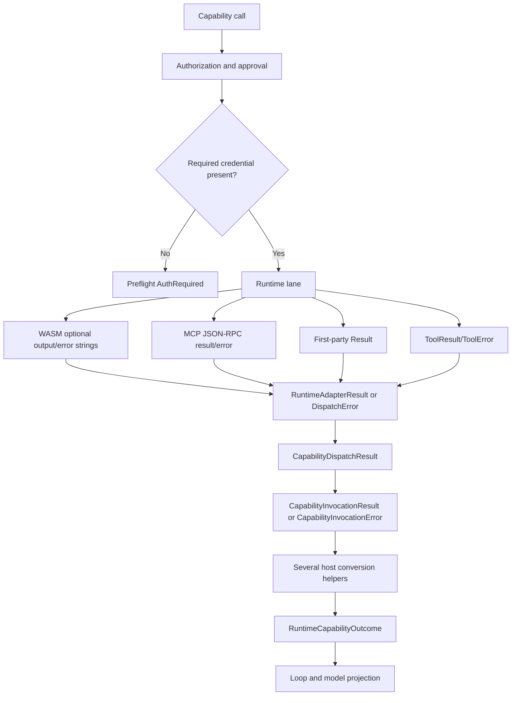
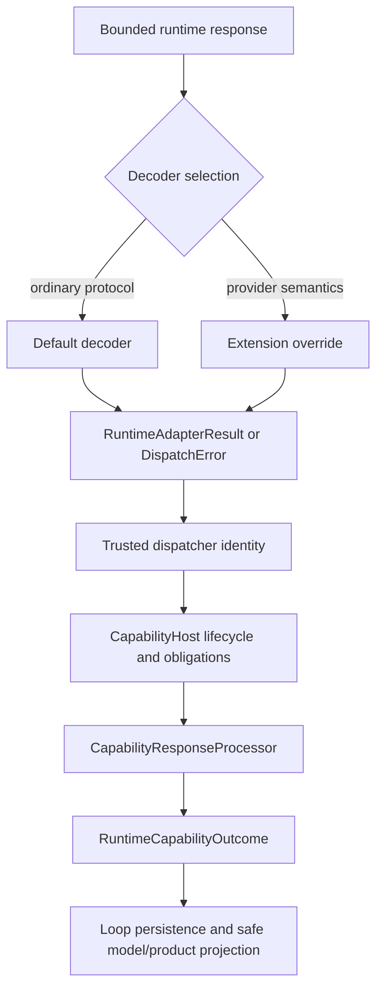

# Capability Response Processing Plan

**Status:** Proposed

**Date:** 2026-08-14

**Related issue:** #7627

**Supersedes:** The closed, GitHub-specific approach in PR #7668

**Visual walkthrough:**
[`capability-response-normalization.html`](./capability-response-normalization.html)

## 1. Decision

Use the existing `RuntimeCapabilityOutcome` as the one host-level outcome
model. Do not add a parallel `CapabilityInvocationOutcome` enum.

Every capability invocation follows one fixed host-runtime pipeline:

```text
authorize and prepare
→ execute through the selected runtime lane
→ decode with the protocol default or extension override
→ attach trusted dispatch identity and complete obligations
→ process the capability response centrally
→ produce RuntimeCapabilityOutcome
→ project safely to the model and product
```

The existing variants already cover the response meanings we need:

```rust
pub enum RuntimeCapabilityOutcome {
    Completed(Box<RuntimeCapabilityCompleted>),
    ApprovalRequired(RuntimeApprovalGate),
    AuthRequired(RuntimeAuthGate),
    ResourceBlocked(RuntimeResourceGate),
    SpawnedProcess(RuntimeProcessHandle),
    Failed(RuntimeCapabilityFailure),
}
```

Inline response processing produces `Completed`, `Failed`, `AuthRequired`, and
fresh-invocation `ApprovalRequired`. Resource blocking and process spawning
remain separate host orchestration outcomes. Remove the current `Unknown`
variant: it has no production producer, the enum is not a durable wire schema,
and exhaustive matching is desirable at this in-process boundary.

Persisted records remain separate from the in-memory runtime enum. They use
explicit, tolerant Serde contracts so additive diagnostic metadata does not
require a data migration.

## 2. Goals

1. Give the model the best bounded provider rejection context available.
2. Make success, provider rejection, and authentication rejection consistent
   across WASM, MCP, first-party, and native extension adapters.
3. Provide safe protocol defaults that custom extensions can use without
   implementing response parsing from scratch.
4. Allow provider-specific overrides without bypassing host policy.
5. Reuse `RuntimeCapabilityOutcome` and the existing auth gate.
6. Make persisted records evolve through additive fields and tolerant reads,
   reserving migrations for true semantic or storage-index changes.
7. Preserve authorization, credential mediation, resource accounting,
   side-effect verification, redaction, and prompt-injection fencing.
8. Remove wrappers and translations that do not add authority, trust, safety,
   or persistence semantics.

## 3. Non-goals

- Credential probing during installation.
- A fourth public extension lifecycle state.
- Clearing a rejected credential automatically.
- A second host outcome enum.
- Inferring authentication from arbitrary message text.
- A manifest language for response parsing.
- Vendor-specific branches in generic host crates.
- Applying design patterns merely because they appear in a catalog.
- Moving authorization, obligation completion, resource reconciliation, or
  model-safe persistence into the response processor.

## 4. Current user experience

Credential readiness currently means that required credential material exists;
it does not mean that a remote provider has recently accepted it.

```text
User saves "1" as a GitHub token
    → secret is stored
    → required credential is present
    → extension projects as active
    → no provider request has occurred

First GitHub tool call
    → GitHub returns 401 {"message":"Bad credentials"}
    → guest classifies the call as auth required
    → run parks on the existing auth gate
    → model receives only generic auth context
```

The run correctly asks for authentication. The defect is that provider context
is lost and caller-visible readiness does not reflect the observed rejection.

The public lifecycle contract already has only `uninstalled`, `setup_needed`,
and `active`; internal `Configured` is a recovery checkpoint, not a public
state. See
[`state.rs`](../../../../crates/contracts/ironclaw_extension_contracts/src/state.rs).

## 5. Current technical flow



### 5.1 Existing good boundaries

- External traffic already uses mediated egress and host-side credential
  injection.
- Runtime lanes already converge on `RuntimeAdapterResult` or `DispatchError`.
- Successful dispatches already share resource accounting, document extraction,
  output redaction, size enforcement, and standard-operation validation.
- Failures already reach one loop-owned secret scrub and prompt-injection fence.
- `RuntimeCapabilityOutcome` already expresses completion, failure, and auth.

Relevant implementations:

- [`runtime_adapters.rs`](../../../../crates/kernel/ironclaw_host_runtime/src/services/runtime_adapters.rs)
- [`handler.rs`](../../../../crates/kernel/ironclaw_host_runtime/src/obligations/handler.rs)
- [`production.rs`](../../../../crates/kernel/ironclaw_host_runtime/src/production.rs)
- [`capability_port.rs`](../../../../crates/loop/ironclaw_loop_host/src/capability_port.rs)

### 5.2 Unnecessary middle translations

The current post-execution path carries the same response through more shapes
than its semantics require:

```text
RuntimeAdapterResult / DispatchError
    → CapabilityDispatchResult
    → CapabilityInvocationResult / CapabilityInvocationError
    → completed_outcome_from / completed_or_output_violation_outcome
      or translate_invocation_error / resume-specific matches
    → RuntimeCapabilityOutcome
```

Not every arrow is waste:

- `RuntimeAdapterResult → CapabilityDispatchResult` stays. The adapter reports
  execution data; the dispatcher adds host-trusted capability, provider, and
  runtime identity and emits dispatch events.
- `RuntimeCapabilityOutcome → loop Resolution` stays. The loop owns durable
  result writing, resume references, secret scrubbing, injection fencing, and
  model-visible projection.
- `CapabilityInvocationError` stays as the capability workflow's authority and
  lifecycle error vocabulary, but its dispatch arm should carry one neutral
  dispatch failure instead of remapping lane-specific variants.

The following add no independent contract and should be removed or folded:

- the single-field `CapabilityInvocationResult { dispatch }` wrapper;
- `completed_outcome_from`;
- scattered success handling in invoke, approval-resume, and auth-resume;
- scattered auth and failure matches across those same entry points;
- lane-named provider failure variants (`Mcp`, `Script`, `Wasm`,
  `FirstParty`);
- the in-process `RuntimeCapabilityOutcome::Unknown` fallback.

### 5.3 Fragmented response interpretation

#### WASM

The current WIT response has `output: option<string>` and
`error: option<string>`. Bundled guests encode structured failure data into the
error string, which the host reparses. See
[`tool.wit`](../../../../crates/lanes/ironclaw_wasm/wit/tool.wit) and
[`wasm_execution.rs`](../../../../crates/kernel/ironclaw_host_runtime/src/services/wasm_execution.rs).

#### MCP

The MCP client parses JSON-RPC errors but currently treats any JSON-RPC result
as successful output, including `CallToolResult { isError: true }`. See
[`client.rs`](../../../../crates/lanes/ironclaw_mcp/src/client.rs).

#### First-party and ToolAdapter

First-party handlers and native adapters use different failure shapes and carry
auth diagnostics differently. See
[`first_party.rs`](../../../../crates/kernel/ironclaw_host_runtime/src/first_party.rs)
and
[`tool_adapter.rs`](../../../../crates/contracts/ironclaw_extension_contracts/src/tool_adapter.rs).

## 6. Simplified target architecture



### 6.1 Central processor

`ironclaw_host_runtime` owns one concrete processing entry point. Do not add a
trait: there is one policy implementation and no dependency-inversion boundary
requiring another. Every inline execution entry point calls this processor:
fresh invocation, approval resume, and auth resume.

```rust
pub(crate) async fn process_capability_response(
    context: CapabilityResponseContext<'_>,
    response: Result<CapabilityDispatchResult, CapabilityInvocationError>,
) -> Result<RuntimeCapabilityOutcome, HostRuntimeError>;
```

`CapabilityResponseContext` carries facts, not services hidden behind another
framework: capability id, scope, invocation id, registry descriptor facts, and
the invocation mode (`Fresh`, `ApprovalResume`, or `AuthResume`). The mode keeps
rules such as "a resume cannot start a second approval loop" inside one
exhaustive match.

Its mapping is direct:

```text
Ok(dispatch)                               → validate output → Completed
Err(AuthorizationRequiresAuth { ... })     → AuthRequired
Err(AuthorizationRequiresApproval { ... }) → ApprovalRequired or failed resume
Err(Dispatch { failure })                  → Failed
Err(other workflow/lifecycle error)        → existing fail-closed mapping
```

Provider-observed authentication rejection reaches that first auth row through
one explicit lift before the processor:

```text
decoder observes a protocol-auth rejection (for example HTTP 401)
    → DispatchError::AuthRequired { diagnostic, attempt }
    → CapabilityHost joins it with the prepared credential obligations
    → CapabilityInvocationError::AuthorizationRequiresAuth {
          required_secrets,
          credential_requirements,
          diagnostic,
      }
    → CapabilityResponseProcessor
    → RuntimeCapabilityOutcome::AuthRequired
```

Preflight credential absence constructs the same fully enriched
`CapabilityInvocationError::AuthorizationRequiresAuth` without a provider
diagnostic. The processor therefore has one auth mapping rather than separate
preflight, WASM, MCP, and first-party branches.

The processor owns:

- the only conversion from inline `CapabilityHost` responses to
  `RuntimeCapabilityOutcome`;
- standard-operation output validation;
- failure disposition and write retry safety;
- auth-gate construction;
- bounded diagnostic construction and host-side secret scrubbing;
- post-dispatch invocation-state failure recording currently coupled to the
  conversion helpers.

It does not own vendor parsing, trusted identity attachment, authorization,
approval/lease mechanics, obligation completion, resource reconciliation,
durable result writing, or model prompt construction.

### 6.2 Keep, collapse, delete

| Current element | Decision | Reason |
| --- | --- | --- |
| Runtime adapters | Keep | Real protocol and execution variation. |
| `RuntimeAdapterResult` | Keep | Pre-identity execution payload; adapters cannot assert host identity. |
| `CapabilityDispatchResult` | Keep | Post-dispatch trusted identity and accounting result. |
| `CapabilityInvocationResult` | Delete | Single-field wrapper with no invariant. |
| `CapabilityInvocationError` | Keep and simplify | Owns authorization, approval, obligation, lease, and dispatch workflow failures. |
| Lane-specific dispatch failure variants | Collapse | Runtime lane is metadata, not a different failure semantic. |
| Completion/error translation helpers | Fold into processor | Duplicated policy and branching. |
| `RuntimeCapabilityOutcome::Unknown` | Delete | No production producer and no persistence compatibility role. |
| Loop outcome projection | Keep | Persistence and model-safety boundary owned by the loop. |

### 6.3 Consolidate `DispatchError`

Today `DispatchError` has separate `Mcp`, `Script`, `Wasm`, and `FirstParty`
provider-failure shapes. Converge provider answers while retaining distinct
host faults:

```rust
pub enum DispatchError {
    AuthRequired {
        capability: CapabilityId,
        diagnostic: Option<ProviderDiagnostic>,
        attempt: DispatchAttemptAccounting,
    },

    Rejected {
        runtime: RuntimeKind,
        kind: DispatchFailureKind,
        diagnostic: Option<ProviderDiagnostic>,
        detail: Option<DispatchFailureDetail>,
        attempt: Option<DispatchAttemptAccounting>,
    },

    UnknownCapability { /* existing fields */ },
    UnknownProvider { /* existing fields */ },
    RuntimeMismatch { /* existing fields */ },
    MissingRuntimeBackend { /* existing fields */ },
    MissingAuthorization { /* existing fields */ },
    AuthorizationExpired { /* existing fields */ },
    // Other genuine host/runtime faults.
}
```

`DispatchError::AuthRequired` deliberately does **not** carry
`required_secrets` or `credential_requirements`. A lane knows the provider
response but does not own registry or credential-setup policy. `CapabilityHost`
derives those fields from the already prepared secret/credential obligations
and descriptor requirements:

1. Exactly one applicable credential binding: construct the auth requirement.
2. No applicable binding: fail as a typed configuration/dispatch failure; do
   not create an empty auth gate.
3. Multiple applicable bindings with no host-known attribution: fail with the
   existing `DispatchFailureKind::Runtime(RuntimeDispatchErrorKind::SecretDenied)`
   plus bounded host-authored detail; do not guess which account or provider to
   prompt. No ambiguity-specific enum variant is added.

If a future multi-credential request can identify the failed binding, that
identity must come from host-mediated injection metadata, not a vendor string
or lane-owned registry lookup. It remains host-internal and does not add an
account-level public projection.

`ProviderDiagnostic` is shared by ordinary rejection and authentication:

```rust
pub struct ProviderDiagnostic {
    pub code: Option<ProviderErrorCode>,
    pub message: Option<UntrustedProviderMessage>,
    pub retry_after: Option<Duration>,
}

pub struct DispatchAttemptAccounting {
    pub usage: ResourceUsage,
    pub receipt: ResourceReceipt,
}
```

Diagnostic values must be bounded, omitted from `Debug`, never logged directly,
and scrubbed/fenced before model visibility.

`ProviderDiagnostic` remains a passive three-field value. Do not add behavior,
provider rules, or convenience methods to it; extraction and safety stay in
the decoder and model-projection owners.

Use the existing neutral `DispatchFailureKind` as the canonical taxonomy.
Extend it only when a provider semantic cannot be represented without losing
behavior; do not create a parallel HTTP/MCP/provider error-kind enum.

`CapabilityInvocationError::Dispatch` should carry this neutral failure
directly. It must not decompose the failure into strings and then make
`ironclaw_host_runtime` reconstruct its meaning.

### 6.4 Extend payloads, not the outcome enum

Add the same optional diagnostic to the existing payloads:

```rust
pub struct RuntimeCapabilityFailure {
    // Existing public fields.
    provider_diagnostic: Option<ProviderDiagnostic>,
}

pub struct RuntimeAuthGate {
    // Existing gate fields.
    provider_diagnostic: Option<ProviderDiagnostic>,
}
```

No new `RuntimeCapabilityOutcome` variant is required.

The provider diagnostic is metadata, never gate identity.
`stable_auth_gate_id` continues to hash only capability id, required secret
handles, and canonical credential requirements. Changing provider wording,
status text, or retry metadata cannot create a different auth gate.

The durable `LoopGateRef` is an immutable observation-record key, not that
logical gate identity. Because `GateRecordStorePort` is write-once, the record
key additionally fingerprints the canonical scrubbed diagnostic bytes. This
prevents a later rejection from aliasing an older record and replaying stale
provider context while leaving `RuntimeGateId` stable for lifecycle policy.
Repeated identical observations reuse the same record; changed provider text
creates a new immutable evidence record for the same logical auth requirement.

### 6.5 Attempt accounting and safe auth resume

A provider rejection is still a real outbound attempt. `RuntimeDispatcher` is
the one reservation-settlement owner for every inline lane. It retains the
reservation guard, asks the bound adapter only for response semantics plus
measured usage, and reconciles or releases exactly once for success,
`AuthRequired`, and ordinary rejection. Decoders never construct a
`ResourceReceipt`; the dispatcher constructs `DispatchAttemptAccounting` from
the governor result and attaches it before returning above the dispatch seam.

`attempt: None` means the failure occurred before outbound transport. A
post-transport rejection reaching the dispatcher without measured usage or
leaving the dispatcher without attached attempt accounting is an invariant
violation: emit a stable internal/accounting failure signal and fail closed. It
must not silently become an unaccounted provider rejection or auth gate.

`CapabilityHost` aborts prepared completion obligations and staged handoffs on
provider rejection; output obligations do not run because there is no accepted
output. This cleanup happens before the fully enriched invocation error reaches
the processor.

An auth gate implies that replay after credential repair is safe. Therefore a
decoder may emit `AuthRequired` only when the protocol/provider semantics mean
the operation was rejected before authorization and did not commit the
requested side effect. If commit state is unknown, it emits an ordinary
`Rejected` failure with unverified-side-effect detail and no resumable auth
gate.

Auth resume reuses the canonical replay payload, invocation fingerprint, and
any claimed approval lease, then re-enters authorization, obligation
preparation, dispatch, and the same response processor. It is not a blind tool
retry. Caller-level tests must pin that a write-class capability cannot be
re-executed from an ambiguous/unknown-commit response and that a proven
pre-execution auth rejection resumes with the same fingerprint and approval
identity.

## 7. Parsing defaults and overrides

### 7.1 Default HTTP decoder (lands with the versioned adapter contract)

The mediated network boundary sees every request an extension makes, including
intermediate discovery, pagination, and read-back calls. It cannot safely turn
an arbitrary intermediate `401` into the outcome of the whole capability.
Therefore the default decoder is shared host/SDK code invoked by the runtime
adapter for the response the adapter declares terminal; it does not run
implicitly inside `ironclaw_network`. The current string-only WASM response
contract cannot express that declaration, so wiring this default ships with
the PR 3 typed/versioned WASM envelope. MCP can ship its protocol default in PR
2 because the host already owns the complete MCP exchange.

| Provider response | Default dispatch result |
| --- | --- |
| `2xx` JSON | success with structured JSON |
| `2xx` text | success with bounded text |
| Empty `2xx` | success with status metadata |
| `401` | `AuthRequired` |
| `403` | `Rejected(PermissionDenied)` |
| `404` | `Rejected(NotFound)` |
| `409` | `Rejected(Conflict)` |
| `429` | `Rejected(RateLimited)` plus `Retry-After` |
| Other `4xx` | `Rejected(Client)` |
| `5xx` | `Rejected(ProviderUnavailable)` |

The default maps a final `401` to `AuthRequired` only when the request used a
host-mediated credential and the response came from the intended allowlisted
provider endpoint. Pass those two request facts as narrow function parameters;
do not introduce a growing `DecoderContext` object. A proxy challenge, redirect
target, or otherwise unattributable `401` is an ordinary rejection with no
auth-resume gate.

Default diagnostic extraction is an internal ordered chain:

1. RFC 7807 `title` and `detail`.
2. `message`.
3. `error.message`.
4. `error_description`.
5. String-valued `error`.
6. Bounded textual body with an allowed content type.
7. Status-only fallback.

The default never infers auth from arbitrary message text and does not treat
`403` as proof that a credential is invalid.

### 7.2 Protocol-specific defaults

MCP requires a protocol decoder rather than the generic HTTP decoder:

- HTTP auth challenge → `AuthRequired`.
- JSON-RPC `error` → `Rejected` with bounded code/message.
- `CallToolResult.isError == true` → `Rejected`.
- Missing or malformed protocol fields → execution fault.

Local first-party results construct the dispatch result directly.

### 7.3 Extension override

Provider packages own special semantics:

- Slack `200` with `ok: false`.
- GitHub validation-specific `422` responses.
- GraphQL `200` with a non-empty `errors` array.
- Shared Google error envelopes.
- Provider-issued evidence for side-effecting success.

Overrides return the same existing `RuntimeAdapterResult`/`DispatchError`
contract. They cannot bypass mediated transport, credentials, accounting,
obligations, output validation, or model safety. The adapter does not call the
central processor itself; the canonical `CapabilityHost → host runtime` path
does, so no extension can bypass it.

## 8. Persistence without routine migrations

### 8.1 Keep runtime and persisted models separate

`RuntimeCapabilityOutcome` is an in-memory host decision. Do not serialize it
directly as the durable schema.

Persist the existing stable boundary records—gate records, resolutions, result
references, events, and projections. This avoids coupling every runtime enum
change to stored data.

```text
RuntimeCapabilityOutcome
    → existing durable gate/resolution/event record
    → Serde bytes
```

This is not an additional business transformation; it is the existing
persistence boundary.

### 8.2 Additive Serde rules

Optional metadata is additive:

```rust
#[derive(Serialize, Deserialize)]
struct PersistedAuthGate {
    // Required authority and identity fields remain required.
    gate_id: RuntimeGateId,
    capability_id: CapabilityId,
    credential_requirements: Vec<RuntimeCredentialAuthRequirement>,

    #[serde(default, skip_serializing_if = "Option::is_none")]
    provider_diagnostic: Option<ModelDiagnostic>,
}
```

Rules:

1. New optional fields use `#[serde(default)]` and normally
   `skip_serializing_if`.
2. Readers tolerate unknown fields on persisted records.
3. Removed fields are no longer emitted; newer readers ignore old unknown
   fields.
4. Wire field names and enum tags are explicit and never reused.
5. Renames use a stable `rename` plus temporary `alias` when necessary.
6. Add a schema version only for semantic incompatibility, not every field.
7. Unknown future persisted kind tags fail safely or map to a persisted-record
   compatibility representation; they never become runtime success.
8. Golden fixtures prove old bytes load under the new reader.
9. Forward-compatibility fixtures prove unknown additive fields do not break
   reads.
10. Mutable read-modify-write records must preserve unknown fields or avoid
    down-level rewriting. Append-only/write-once records naturally avoid this
    loss.

### 8.3 Fields that must not default

Do not apply tolerant defaults to authority-bearing data:

- tenant, user, thread, invocation, capability, or gate identity;
- authorization or approval evidence;
- credential authority/provider identity;
- resource ownership;
- side-effect evidence needed to claim completion.

Missing security-critical fields fail closed. Evolution tolerance must never
manufacture authority.

### 8.4 When a real migration is still required

A migration remains appropriate when:

- a storage index or query key changes;
- existing records need semantic backfill;
- encryption or credential custody changes;
- a required authority field changes meaning;
- records must be repartitioned or moved between stores.

Adding an optional provider diagnostic should not require one.

### 8.5 Prove `Unknown` is not persistence compatibility

Removing `RuntimeCapabilityOutcome::Unknown` touches host-runtime, loop-host,
and product-composition consumers even though its constructors are test-only.
Before deletion, add an explicit compatibility test that:

1. loads a legacy persisted loop resolution/failure fixture containing an
   unrecognized open-set failure tag and unknown additive fields;
2. replays/projects it as a bounded `Unclassified` failure;
3. proves it cannot become success or a host-internal abort; and
4. proves no persisted/replay record deserializes into
   `RuntimeCapabilityOutcome` itself.

Then remove the `Unknown` arms from loop projection, milestone projection,
capability-id validation, product projection, and their synthetic tests in the
same PR. Persistence compatibility remains at the persisted record reader,
where it belongs, rather than in an in-memory host enum that is never
deserialized.

## 9. Design patterns applied deliberately

The [Refactoring.Guru catalog](https://refactoring.guru/design-patterns/catalog)
is used as vocabulary for actual design pressures, not as a checklist.

### Adapter

WASM, MCP, first-party, and native `ToolAdapter` outputs adapt into the existing
`RuntimeAdapterResult`/`DispatchError` contract. Runtime implementation does
not become product taxonomy.

### Facade

`CapabilityResponseProcessor` is the single host-runtime entry point for
success validation, failure classification, auth-gate construction, and
`RuntimeCapabilityOutcome` construction. It is a concrete module/type, not a
service trait.

### Optional Strategy

Response decoding varies between the protocol default and real provider
implementations. Use the existing runtime/extension adapter boundary first.
Introduce a new trait only if at least two production decoders are dynamically
selected at one boundary or dependency inversion requires it.

The fixed call sequence and ordered diagnostic extraction remain ordinary
functions. Do not introduce Template Method or Chain of Responsibility class
hierarchies merely to name those control flows.

### Patterns intentionally not added

- No new State pattern: the existing outcome and lifecycle enums are enough.
- No Abstract Factory: runtime selection already exists.
- No Visitor: outcome handling is a normal exhaustive match.
- No Memento: durable records are domain contracts, not undo snapshots.
- No Decorator for parsing: existing obligations already own post-dispatch
  policy composition.
- No processor trait: one production policy implementation does not justify
  dynamic dispatch.

## 10. User experience

### Saving credentials

```text
validate local shape and bounds
→ store securely
→ active when declared setup is present
→ do not claim remote verification occurred
```

### Provider accepts the credential

```text
provider success
→ RuntimeCapabilityOutcome::Completed
→ output/effect validation
→ model receives successful observation
```

### Provider rejects the credential

```text
typed AuthRequired dispatch result
→ stored credential retained
→ RuntimeCapabilityOutcome::AuthRequired
→ existing durable auth gate
→ model receives bounded provider code/message
→ user replaces credential or adds scopes
→ canonical resume retries the capability
```

Do not mutate the extension's internal checkpoint to `Configured` and do not
clear credentials. If the extension card must react immediately, optionally
derive existing `setup_needed` from an unresolved caller-scoped auth gate in a
separate product-projection change.

## 11. Implementation sequence

### PR 1: Centralize and simplify without changing behavior

1. Extend existing caller-level tests to pin invoke, approval-resume, and
   auth-resume success/failure/auth behavior.
2. Add the concrete `CapabilityResponseProcessor` in `ironclaw_host_runtime`.
3. Route all three inline completion paths through it.
4. Remove `CapabilityInvocationResult`, fold the completion/error helper chain,
   and remove duplicated resume matches.
5. Add the legacy persisted-resolution/open-set-tag compatibility test from
   §8.5, then remove `RuntimeCapabilityOutcome::Unknown` across
   `ironclaw_host_runtime`, `ironclaw_loop_host`, and
   `ironclaw_composition` plus their synthetic branches.
6. Prove no runtime adapter or alternate caller constructs inline outcomes
   around the processor.

### PR 2: Shared diagnostic and protocol defaults

1. Extend the existing caller-level GitHub auth-gate integration scenario.
2. Add MCP `isError`, first-party auth, and ToolAdapter auth coverage.
3. Introduce bounded `ProviderDiagnostic` and additive persisted diagnostics.
4. Consolidate provider rejection shapes in `DispatchError`.
5. Make `CapabilityHost` enrich provider-observed auth from prepared credential
   obligations; ambiguous attribution fails without an auth gate.
6. Implement MCP semantic decoding and pin the HTTP default's conformance
   contract; defer HTTP wiring until the versioned adapter envelope can name a
   terminal response without guessing at the network layer.
7. Reconcile usage for post-transport auth/rejection responses and carry the
   receipt through dispatch accounting.
8. Route auth and ordinary rejection diagnostics through the same safe model
   projection while preserving resource receipts and write retry safety.
9. Prove old persisted fixtures still deserialize.

### PR 3: WASM contract and bundled packages

1. Replace optional output/error ambiguity with a typed WIT response or a
   versioned, structured wire envelope that maps directly to the existing
   dispatch contract.
2. Add the shared default HTTP decoder from §7.1 and let packages override
   provider-specific terminal-response semantics while returning the same
   dispatch contract.
3. Keep temporary legacy decoding.
4. Migrate GitHub, Slack, Google Docs, Drive, Sheets, and Slides.
5. Rebuild committed WASM artifacts.
6. Include shared decoder/SDK sources in artifact freshness if introduced.

### PR 4: Product projection and cleanup

1. Decide whether unresolved caller auth gates project `setup_needed`.
2. Verify the same behavior in chat setup and Settings.
3. Remove legacy WASM string-error parsing.
4. Remove lane-specific diagnostic fields and compatibility mappings.
5. Ensure `DispatchError` cleanly separates provider rejection from host fault.

## 12. Test strategy

### Decoder conformance

- JSON, text, and empty success bodies.
- `401`, `403`, `404`, `409`, `422`, `429`, and `5xx`.
- RFC 7807 and conventional error envelopes.
- MCP JSON-RPC error and `CallToolResult.isError`.
- Provider-observed auth with exactly one, zero, and multiple applicable
  credential bindings.
- Missing, oversized, malformed, and non-UTF-8 bodies.
- Retry metadata.
- Post-transport rejection usage and reservation reconciliation.
- Secret-shaped and prompt-injection content.

### Persistence compatibility

- Old fixture without diagnostic loads with `None`.
- New fixture round-trips diagnostic bytes.
- Unknown additive field is ignored safely.
- Missing authority field fails.
- Unknown outcome/gate kind cannot become success.
- Legacy persisted unknown failure tag becomes bounded `Unclassified` without
  relying on `RuntimeCapabilityOutcome::Unknown`.
- All inline invocation modes reach the same processor.
- No lane-specific provider error variant survives after compatibility cleanup.
- Replay identity remains deterministic.
- Down-level read-modify-write cannot erase unknown fields.

### Caller-level integration

Drive:

```text
submit turn
→ runtime dispatch
→ mediated provider response
→ default or override decoder
→ central processor
→ failure or auth gate
→ deny/resume where applicable
→ eventual model request
```

Assert that provider context reaches one model request, secrets do not, auth is
not reported as success, provider rejection does not become a fatal host error,
and side-effecting writes are not retried blindly. For auth resume, assert that
the replay uses the same invocation fingerprint and approval identity, a
provider-auth rejection with unknown commit state does not create a resumable
gate, and the original failed attempt remains resource-accounted.

### Verification commands

```bash
cargo test -p ironclaw_architecture_tests
cargo test -p ironclaw_host_runtime
cargo test -p ironclaw_mcp
cargo test -p ironclaw_extension_contracts
cargo test -p ironclaw_integration_tests --test reborn_integration_auth_gate
python3 scripts/ci/check-wasm-artifact-freshness.py
python3 scripts/ci/docs_publication_boundary.py
cargo fmt --all -- --check
```

Run clippy with warnings denied for every changed crate.

## 13. Security invariants

1. Provider text is untrusted data, never a host safe summary.
2. Diagnostics are bounded and omitted from `Debug` and routine logs.
3. The final model seam scrubs secret values and fences prompt injection.
4. Raw response bodies never enter resumable loop state.
5. Decoder overrides cannot bypass host policy.
6. Authentication is typed; message heuristics are forbidden.
7. `403` defaults to permission denial, not forced reauthentication.
8. A provider-observed auth gate is emitted only for a rejection known to have
   occurred before the requested side effect committed.
9. Credential prompt requirements are derived by `CapabilityHost`, never by a
   runtime lane or vendor string; ambiguous attribution fails closed.
10. Every post-transport attempt is resource-accounted even when rejected.
11. Additive Serde defaults never apply to authority-bearing fields.
12. Unknown persisted kinds fail closed.
13. No migration or cleanup deletes credential or LLM data.

## 14. Completion criteria

1. No parallel `CapabilityInvocationOutcome` exists.
2. `CapabilityInvocationResult` and `RuntimeCapabilityOutcome::Unknown` are
   removed.
3. Fresh invocation, approval resume, and auth resume all produce inline
   runtime outcomes through one concrete processor.
4. Runtime adapters return only the shared dispatch contract and cannot bypass
   the processor.
5. Conventional custom HTTP extensions have a safe default decoder.
6. Provider packages can override decoding without bypassing host policy.
7. MCP `isError` cannot pass as success.
8. Auth and ordinary rejection share one bounded diagnostic type.
9. Provider-observed auth is enriched by `CapabilityHost`; lanes never invent
   credential requirements and ambiguous attribution does not create a gate.
10. Provider-auth and rejection attempts settle resource accounting, and auth
    resume preserves fingerprint/approval identity plus write replay safety.
11. Optional persisted diagnostics require no data migration.
12. Old fixtures and unknown additive fields deserialize safely.
13. Legacy unknown failure tags remain safely projectable after removing the
    in-memory `Unknown` variant.
14. Missing authority data fails closed.
15. The public lifecycle remains three states and rejected credentials remain
    editable.

## 15. Decisions to confirm before implementation

1. Whether default HTTP decoding fits `ironclaw_extension_support` or justifies
   a small multi-consumer WASM-safe SDK.
2. Whether the WASM contract uses a typed WIT variant immediately or a
   versioned structured envelope first.
3. Whether unresolved caller auth gates immediately project `setup_needed`.
